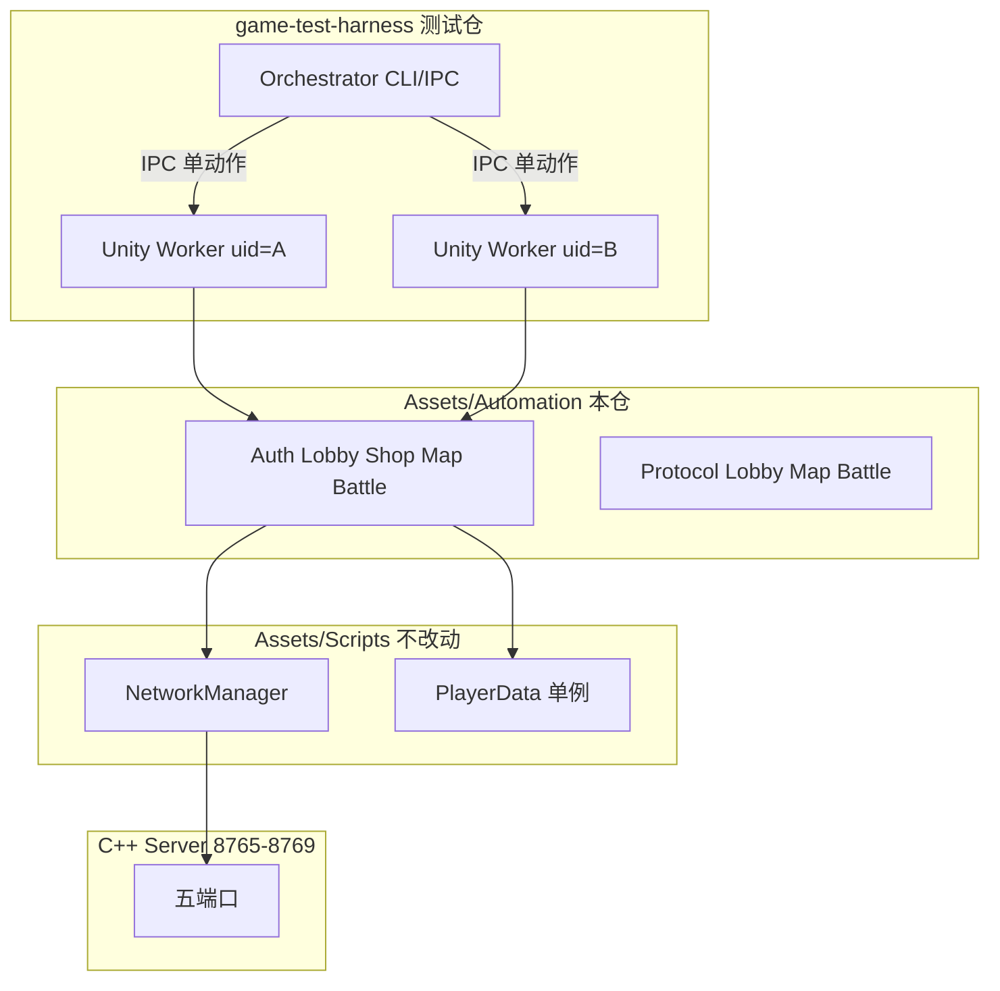

# 客户端 Automation 层实现计划

> **服务端对齐源**：`/home/pluto559/workspace/server`（`include/protocol.h`、`docs/TESTING.md`）  
> **测试仓 Orchestrator/IPC**：[测试仓库方案.plan.md](测试仓库方案.plan.md)

## 目标与约束

**目标**：提供可被测试仓库 **Orchestrator** 经 IPC 调用的**动作级**公共 API；Worker 内仍走真实 `NetworkManager` + 协议，连接真实 C++ 五端口服务端。

**架构分工**：

| 组件 | 仓库 | 职责 |
|------|------|------|
| **Automation Sessions** | `Software_client/Assets/Automation/` | 单动作 coroutine（Register、SetReady、InitMap…） |
| **Unity Worker** | `game-test-harness` | 常驻 batchmode 进程，一进程一 uid，执行单条 IPC 动作 |
| **Orchestrator** | `game-test-harness` | 启停 Worker、多玩家同步、coord 文件、逐条 CLI |
| **游戏本体** | `Assets/Scripts/` | **不改动** |

**硬约束（解耦原则）**：

| 原则 | 说明 |
|------|------|
| **只新增，不修改** | 不编辑 [`Assets/Scripts/`](Assets/Scripts/)（含 `PlayerData`、`NetworkManager`、`ServerNetworkMessages`） |
| **一进程一 uid** | `PlayerData` 为全局单例 → 多客户端靠多 Worker 进程 |
| **独立目录** | 全部新代码在 [`Assets/Automation/`](Assets/Automation/) |
| **只读消费** | 调用现有 public API，不重写 TCP/JSON 栈 |
| **程序集隔离** | `Automation.asmdef` 仅 reference `Network`、`Data`、`Constants` |
| **不驱动 UI** | 不调用 Toast、不切场景、不继承 `StateBase` |



---

## 服务端五端口与阶段机

### 端口表

| 端口 | 服务 | 客户端常量 |
|------|------|------------|
| 8765 | LoginServer | `NetworkConstants.LoginPort` |
| 8766 | HomeServer | `NetworkConstants.HomePort` |
| 8767 | ShopServer | `NetworkConstants.ShopPort` |
| 8768 | MapServer | `NetworkConstants.MapPort` |
| 8769 | BattleServer | **`NetworkEndpointConfig.BattlePort`** |

### 房间阶段（`Room::Phase`）

```
LOBBY → SHOP → MAP → BATTLE → END
```

| 阶段 | 允许操作 | 「下一步」语义 |
|------|----------|----------------|
| LOBBY | CREATE/JOIN/SET_READY/LEAVE | 全员 ready → push `0` → **SHOP** |
| SHOP | SHOP_* | **任意玩家 MAP_INIT** → SHOP→MAP（非 shop opcode） |
| MAP | MAP_INIT / MAP_MOVE | 全员同 `selectId` → push `1` → commit |
| BATTLE | PLAYER_READY / POSITION_SYNC / SHOOT | BATTLE_END push `1` |
| END | LEAVE / LOGOUT | 先 LEAVE_ROOM 再 LOGOUT |

### 关键推送（`pushMessages`）

| 域 | 值 | 含义 |
|----|-----|------|
| Home | `0` | ALL_READY → SHOP |
| Map | `1` | MAP_SYNC commit |
| Battle | `0` | BATTLE_START |
| Battle | `1` | BATTLE_END |

### 无 direct response 的命令

`SET_READY`、`SHOP_MOVE_CURSOR`、`SHOP_BUY`、`MAP_MOVE`、`POSITION_SYNC`（type=**1**）、`PLAYER_SHOOT`

---

## GET_STATE_STATUS（type=9，8766 短连）

服务端已实现（见 `docs/TESTING.md`）。Automation 封装为 `LobbySession.GetStateStatus()`。

**请求**：`{"type": 9, "uid": "<uid>"}`

**成功 `data` 字段**（`GetStateStatusResponse`）：

| 字段 | 说明 |
|------|------|
| `online` | 是否在线 |
| `roomId` | 不在房为 -1 |
| `roomPhase` | 0=LOBBY, 1=SHOP, 2=MAP, 3=BATTLE, 4=END |
| `roomMemberCount` | 房间人数 |
| `allLobbyReady` | 大厅全员 ready |
| `mapNodeId` | 已提交地图节点，未提交 -1 |
| `battleTick` | 战斗 tick，非战斗为 0 |

用途：Orchestrator/GUI **轮询**阶段；CLI 仍可用 push 等待，不强制依赖此接口。opcode 定义在 `Automation.Protocol.LobbyRequestType`（本体 `HomeRequestType` 尚无 9）。

---

## 动作级 API 清单（Worker IPC 映射）

每条 API 为 `IEnumerator`，Worker 一次执行一条；Orchestrator 负责多 Worker 时序与同步。

### AuthSession

| 方法 | 说明 |
|------|------|
| `RegisterAndLogin(onUid?)` | 注册并登录 |
| `Register(onUid?)` | 仅注册 |
| `Login(uid)` | 登录，初始化 `PlayerData` |
| `Logout()` | 登出（须先离房） |

`GameClientSession.LogoutSafely()`：LeaveRoom → 断开各域长连 → Logout。

### LobbySession

| 方法 | 说明 |
|------|------|
| `EnsureLongConnection()` | 建立 8766 长连 |
| `ListRooms(onRooms?)` | LIST_ROOMS |
| `CreateRoom(maximumPeople)` | 建房 + 长连 |
| `JoinRoom(roomId)` | 入房 + 长连 |
| `SetReady(ready)` | SET_READY |
| `WaitForAllReady()` | 等 push `0` |
| `LeaveRoom()` | LEAVE_ROOM |
| `GetStateStatus(onStatus?)` | GET_STATE_STATUS(9) |

### ShopSession

| 方法 | 说明 |
|------|------|
| `Skip()` | **无操作**。不发送任何 shop 包；阶段推进靠 `Map.InitMap` |
| `Init()` | SHOP_INIT |
| `AutoBuyFirst()` | 买第一件可负担商品 |

### MapSession

| 方法 | 说明 |
|------|------|
| `InitMap(roomId)` | MAP_INIT（可从 SHOP 触发阶段切换） |
| `SelectDefaultRoute()` | 默认根节点 |
| `SelectRoute(selectId)` | MAP_MOVE |
| `WaitForMapCommit()` | 等 push `1` |

### BattleSession

| 方法 | 说明 |
|------|------|
| `Connect()` | 8769 长连 |
| `PlayerReady()` | PLAYER_READY |
| `WaitForBattleStart()` | 等 BATTLE_START |
| `SendPositionSync(x,y,dirX,dirY)` | 单次 POSITION_SYNC（type=1） |
| `SendShoot(dirX, dirY)` | PLAYER_SHOOT |
| `IdleUntilEnd(timeout?)` | 周期 POSITION_SYNC 直至 BATTLE_END |

### GameClientSession（组合流，非 IPC 必需）

| 方法 | 说明 |
|------|------|
| `RunSinglePlayerFlow(...)` | 端到端冒烟 |
| `DisconnectAll()` | 断开所有长连 |

---

## 目录结构

```
Assets/Automation/
├── Automation.asmdef
├── README.md
├── Config/NetworkEndpointConfig.cs
├── Bootstrap/AutomationBootstrap.cs, AutomationRunner.cs
├── Sessions/
│   ├── AuthSession.cs
│   ├── LobbySession.cs          # + GetStateStatus, public EnsureLongConnection
│   ├── ShopSession.cs           # Skip = no-op
│   ├── MapSession.cs
│   ├── BattleSession.cs           # SendPositionSync
│   └── GameClientSession.cs
├── Protocol/
│   ├── LobbyOpcodes.cs          # GET_STATE_STATUS=9, RoomPhase
│   ├── LobbyMessages.cs         # GetStateStatusRequest/Response
│   ├── MapOpcodes.cs, MapMessages.cs
│   └── BattleOpcodes.cs, BattleMessages.cs
├── Rules/ShopPurchaseRules.cs, MapRouteHelper.cs
└── Util/AutomationAwaiter.cs
```

**不触碰** [`Assets/Scripts/`](Assets/Scripts/)；**不实现** Orchestrator/IPC（属测试仓）。

---

## 与测试仓的关系

- junction 挂载：`Assets/Scripts` + `Assets/Automation` → 详见 [测试仓库方案.plan.md](测试仓库方案.plan.md)
- 旧模式「每条 CLI 启新 Unity、跑完退出」→ **常驻 Orchestrator + 长生命周期 Worker + 逐条动作 CLI**
- Orchestrator 将 CLI 子命令映射为本 plan 动作 API；Worker 内 `AutomationBootstrap.Init` 后执行单条 coroutine

---

## 端到端顺序（Orchestrator 编排参考）

```csharp
yield return Auth.RegisterAndLogin();
yield return Lobby.CreateRoom(4);
yield return Lobby.SetReady(true);
yield return Lobby.WaitForAllReady();   // 或轮询 GetStateStatus → roomPhase==SHOP

yield return Shop.Skip();               // 无操作

yield return Map.InitMap(roomId);       // 触发 SHOP→MAP
yield return Map.SelectDefaultRoute();
yield return Map.WaitForMapCommit();

yield return Battle.Connect();
yield return Battle.PlayerReady();
yield return Battle.WaitForBattleStart();
yield return Battle.SendPositionSync(); // 可选逐步驱动
yield return Battle.IdleUntilEnd();

yield return Lobby.LeaveRoom();
yield return Auth.Logout();
```

---

## 交付清单

- [x] `Assets/Automation/` 完整目录 + `Automation.asmdef`
- [x] 零修改 `Assets/Scripts/`
- [x] 五端口含 8769
- [x] 动作级 Session API
- [x] `GetStateStatus` + Protocol DTO
- [x] `Shop.Skip` 语义文档化
- [x] `Battle.SendPositionSync` 单步 API
- [x] README 动作清单
- [ ] 测试仓 Orchestrator/IPC（测试仓 todo）
- [ ] PlayMode Integration 测试（含 GetStateStatus）

---

## 风险与应对

| 风险 | 应对 |
|------|------|
| 战斗默认 180s | `battle_config.test.json` + `--duration-seconds` |
| JsonUtility 限制 | flat Serializable；`nextId` 用 `int[]` |
| 本体日后合入 Map/Battle/Lobby DTO | 仅改 `Assets/Automation/` |
| SET_READY 无 direct | 发后读 BROADCAST 或轮询 GetStateStatus |
| PlayerData 单例 | 多玩家 = 多 Worker 进程 |
