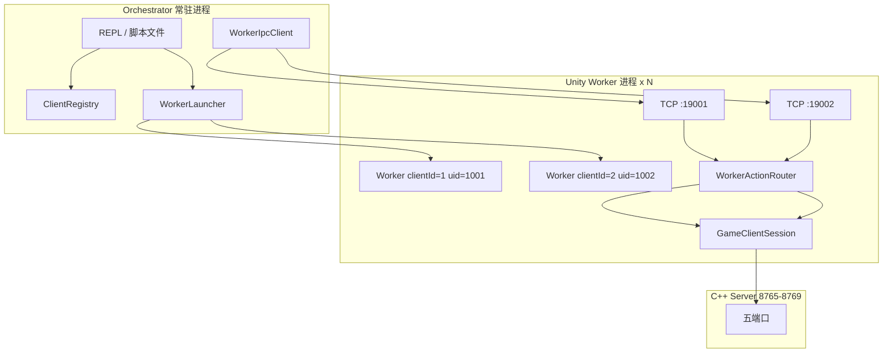
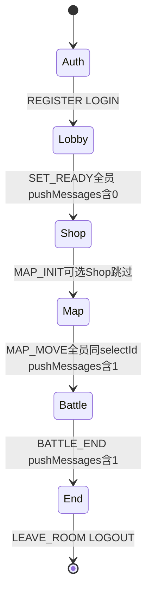

# 测试仓库（Software_qa）实现计划

> **服务端路径**：`\\wsl.localhost\Ubuntu-24.04\home\pluto559\workspace\server`  
> **客户端 Automation**：[客户端Automation方案.plan.md](客户端Automation方案.plan.md)（代码位于 `Assets/Automation/`）

## 目标

- **常驻 Orchestrator + 长生命周期 Worker**：每条 CLI 动作为独立 IPC 指令，进程内保持 TCP 长连接与 `PlayerData`
- **REPL + 脚本文件**：交互调试与可重复场景脚本并存
- **保留 one-shot**：`game-flow` / `full-run` 继续服务 CI 一键冒烟，与新动作模型并存
- **真实链路**：`GameClientSession` → `NetworkManager` → C++ 五端口服务端
- **不改游戏本体**：junction 只读挂载 `Assets/Scripts` + `Assets/Automation`

---

## 架构：Orchestrator + Worker + IPC



| 组件 | 职责 |
|------|------|
| **Orchestrator** | PowerShell `scripts/orchestrator.ps1`；维护 `ClientRegistry`；spawn/kill Worker；发 IPC 动作；REPL 或 `-ScriptPath` 脚本；动作完成后打印 status 表 |
| **Unity Worker** | `Unity -batchmode --mode worker --client-id N --ipc-port P`；进程**不 Quit**，循环收 IPC 指令 |
| **IPC** | localhost TCP 行协议：`ACTION [json]\n` → `OK json\n` / `ERR msg\n` |
| **one-shot CLI** | 原 `CliEntry.Main --cmd X` 路径不变，命令结束即 `Application.Quit` |

**备选**：Unity daemon 作 Orchestrator（单 batchmode 进程内 Registry + spawn 子 Worker）；当前实现为 **PowerShell 脚本**，daemon 列为后续备选。

---

## ClientRegistry 数据结构

```powershell
# Orchestrator 侧（scripts/orchestrator.ps1 内 $registry 哈希表，每项为 ordered dict）
# ClientId, IpcPort, Process, Uid, State, CachedStatus
```

| 字段 | 来源 |
|------|------|
| `Uid` | Worker `register` 动作 → `AuthSession.Register` |
| `CachedStatus.phase` | 已登录时 `LobbySession.GetStateStatus()`（`source=server`）；未登录回退本地 `auth|lobby`（`source=local`） |
| `State` | Orchestrator 维护（启动、销毁、IPC 失败） |

---

## Worker 模式

### 启动参数

```powershell
Unity.exe -batchmode -nographics `
  -projectPath E:\Desktop\Software_qa `
  -executeMethod Harness.Cli.CliEntry.Main `
  --mode worker --client-id 1 --ipc-port 19001 `
  --host 127.0.0.1
```

| 参数 | 说明 |
|------|------|
| `--mode worker` | 进入长生命周期 IPC 循环（**非** one-shot） |
| `--client-id N` | 编排器分配的客户端编号 |
| `--ipc-port P` | Worker 监听的 localhost TCP 端口 |
| `--host` | 服务端地址，传给 `NetworkEndpointConfig` |

Worker 就绪后 stdout 打印：`[Worker] ready clientId=N ipcPort=P`

### IPC 协议

```
请求：  <action> [<json-payload>]\n
成功：  OK <json>\n
失败：  ERR <message>\n
```

| 动作（Worker 已实现/规划） | 映射 |
|--------------------------|------|
| `ping` | 健康检查 |
| `register` | `AuthSession.Register` → `{uid}` |
| `login` | `{"uid":"..."}` → `AuthSession.Login` |
| `status` | 返回 `WorkerStateSnapshot`（待接 GET_STATE_STATUS） |
| `shutdown` | `LogoutSafely` + `DisconnectAll` + Worker 退出 |
| `lobby-connect` | `LobbySession.EnsureLongConnection`（规划） |
| `list-rooms` / `create-room` / `join-room` / `leave-room` | `LobbySession`（规划） |
| `ready-on` / `ready-off` | `LobbySession.SetReady`（规划） |
| `shop-init` / `shop-buy-first` | `ShopSession`（规划） |
| `map-init` / `map-select` / `map-select-default` | `MapSession`（规划） |
| `wait-room-phase` / `wait-map-commit` | 同步等待 push（规划） |
| `battle-ready` / `battle-idle` | `BattleSession`（规划） |

---

## Orchestrator 动作词汇（REPL / 脚本）

Orchestrator 命令与 Worker IPC 动作一一对应（带 `clientId` 路由）：

| Orchestrator 命令 | 说明 |
|-------------------|------|
| `client-create` | 启动 Worker + `register`，返回 clientId, uid |
| `client-destroy <id>` | IPC `shutdown` + 结束进程 |
| `login <id> --uid X` | 指定 Worker 登录 |
| `lobby-connect <id>` | 建立 8766 长连接 |
| `list-rooms <id>` / `create-room <id>` / `join-room <id>` / `leave-room <id>` | 大厅操作 |
| `ready-on <id>` / `ready-off <id>` | SET_READY |
| `shop-init <id>` / `shop-buy-first <id>` | 商店（可选） |
| `map-init <id>` / `map-select <id>` / `map-select-default <id>` | MAP 阶段 |
| `wait-room-phase <id>` / `wait-map-commit <id>` | 同步等待 |
| `battle-ready <id>` / `battle-idle <id>` | 战斗 |
| `status` | 刷新并打印活跃客户端表 |

**规则**：除 `status` / `help` / `exit` 外，**每条动作执行完成后自动调用 `status`**，打印 uid + 状态列。

### REPL 语法

```
harness> client-create
harness> client-create
harness> status
harness> client-destroy 1
harness> exit
```

### 脚本文件格式（`.harness` / `.txt`）

```
# 注释行以 # 开头
# 空行忽略

client-create
client-create
lobby-connect 1
lobby-connect 2
create-room 1 --max 2
join-room 2 --room-id <from-previous>
ready-on 1
ready-on 2
wait-room-phase 1
status
```

执行：

```powershell
.\scripts\orchestrator.ps1 -ScriptPath .\scenarios\two-player-map-exit.harness
```

---

## 示例：两人同局，地图阶段先后退出

前置：`.\scripts\start_server_wsl.ps1` + `.\scripts\wait_ports.ps1`

```text
# scenarios/two-player-map-exit.harness
client-create
client-create

login 1
login 2

lobby-connect 1
lobby-connect 2

create-room 1 --max 2
join-room 2 --room-id $ROOM_ID_1

ready-on 1
ready-on 2
wait-room-phase 1

shop-init 1
shop-init 2

map-init 1
map-init 2
map-select-default 1
map-select-default 2
wait-map-commit 1

battle-ready 1
battle-ready 2
battle-idle 1
battle-idle 2

leave-room 1
status
leave-room 2
status

client-destroy 1
client-destroy 2
```

> **注**：`login 1` 在骨架阶段可省略（`client-create` 已 `register`）；完整动作路由实现后，`$ROOM_ID_1` 等变量由 Orchestrator 从上一动作 JSON 结果注入。

---

## 与旧 one-shot CLI 的关系

| 模式 | 入口 | 生命周期 | 用途 |
|------|------|----------|------|
| **Orchestrator + Worker** | `scripts/orchestrator.ps1` | Worker 长驻 | 分步联调、多人编排、REPL/脚本 |
| **one-shot** | `CliEntry.Main --cmd X` | 命令结束 Quit | CI 冒烟、`game-flow`、`full-run` |

**保留不变**：

- `--cmd game-flow`：单人 SHOP→MAP→BATTLE 一键流程
- `--cmd full-run --players N`：多进程 coord 目录编排
- `scripts/start_server_wsl.ps1`：WSL 服务端启动

---

## 依赖：Automation GetStateStatus

Worker / Orchestrator 的 `status` **最终**以服务端 `GET_STATE_STATUS`（opcode **9**）为准，由客户端 Automation 暴露：

```csharp
// 目标契约（Assets/Automation/Sessions/GameClientSession.cs — 待实现）
public IEnumerator GetStateStatus(Action<StateStatusSnapshot> onResult = null);
```

| 字段（预期） | 说明 |
|--------------|------|
| `phase` | `LOBBY` / `SHOP` / `MAP` / `BATTLE` / `END` |
| `roomId` | 当前房间 |
| `uid` | 当前玩家 |

**已实现**：`WorkerActionRouter` 在 `PlayerData.IsInit()` 时调用 `LobbySession.GetStateStatus()`，映射 `roomPhase` → `lobby|shop|map|battle|end`；失败或未登录时回退 `source=local`。

---

## 服务端连接契约（已对齐 server 仓库）

### 五端口（`config/server.json`）

```json
{
  "host": "127.0.0.1",
  "loginPort": 8765,
  "homePort": 8766,
  "shopPort": 8767,
  "mapPort": 8768,
  "battlePort": 8769
}
```

### 端到端阶段顺序



---

## 仓库布局

```
workspace/
├── Software_client/
│   ├── Assets/Scripts/
│   ├── Assets/Automation/
│   └── .cursor/plans/
│       ├── 客户端Automation方案.plan.md
│       └── 测试仓库方案.plan.md          # 本文档
├── Software_qa/
│   ├── setup.ps1
│   ├── scripts/
│   │   ├── start_server_wsl.ps1         # 不动
│   │   ├── wait_ports.ps1
│   │   └── orchestrator.ps1             # REPL / 脚本入口
│   ├── scenarios/                         # *.harness 脚本
│   └── Assets/Scripts/
│       ├── Cli/CliEntry.cs, CommandParser.cs
│       ├── Bootstrap/HarnessHost.cs
│       ├── Worker/                        # IPC + ActionRouter
│       ├── Launcher/ProcessLauncher.cs
│       └── Scenarios/
└── server/                                # WSL
```

---

## 启动流程（最小可跑通）

```powershell
# 1. 服务端
.\scripts\start_server_wsl.ps1
.\scripts\wait_ports.ps1

# 2. junction（首次）
.\setup.ps1

# 3. 环境变量
$env:UNITY_EDITOR = "C:\Program Files\Unity\Hub\Editor\2022.3.28f1c1\Editor\Unity.exe"
$env:HARNESS_PROJECT_PATH = "E:\Desktop\Software_qa"

# 4. Orchestrator REPL（PowerShell，本机无 SDK 时）
.\scripts\orchestrator.ps1

harness> client-create
harness> status
harness> client-destroy 1
harness> exit
```

---

## 集成验证清单

| # | 场景 | 通过标准 |
|---|------|----------|
| 1 | setup.ps1 未运行 | 编译失败，提示缺少 junction |
| 2 | Orchestrator `client-create` | Worker 启动，register 返回 uid，status 表有行 |
| 3 | `client-destroy` | IPC shutdown，进程退出，表为空 |
| 4 | one-shot `game-flow` | ≤30s 内 BATTLE_END（CI 保留） |
| 5 | `full-run --players 2` | 同房 MAP/Battle 同步（CI 保留） |
| 6 | Worker `status` + GetStateStatus 合并后 | `source=server`，phase 与房间阶段一致 |

---

## 实施顺序（更新）

1. ~~客户端 Automation 脚手架 + Auth/Lobby~~  
2. ~~Software_qa setup + one-shot CLI + game-flow/full-run~~  
3. ~~Worker IPC 骨架 + Orchestrator client-create/status/client-destroy~~（**当前**）  
4. Orchestrator 完整动作词汇路由  
5. Automation `GetStateStatus` + Worker status 切换  
6. 脚本变量与多人场景库  
7. GUI（可选）

---

## 风险与应对

| 风险 | 应对 |
|------|------|
| Unity Worker 启动慢（~30–90s） | Orchestrator `WaitForWorker` 超时 120s + ping 重试 |
| GET_STATE_STATUS 未实现 | 骨架 `source=local`；plan 标明依赖客户端 plan |
| junction 仅 Windows | `setup.sh` symlink 备选 |
| 战斗默认 180s | `start_server_wsl.ps1 -DurationSeconds 5` |
